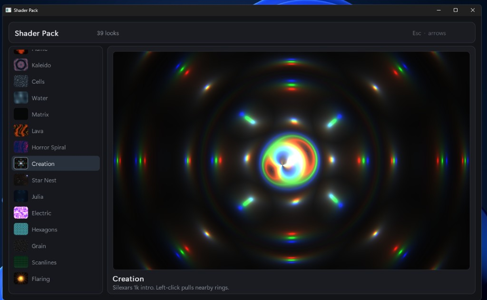

# Custom Shader Pack

Windows previewer for UI shader looks. Hover and click on the stage. Arrows change the look.

  

  <video src="https://github.com/ff0l/Custom-Shader-Pack/releases/download/v1.0.0/preview.mp4" width="100%" controls muted loop></video>

`preview.exe` is in [Releases](https://github.com/ff0l/Custom-Shader-Pack/releases).
